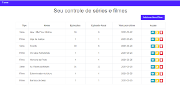
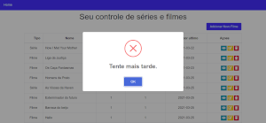
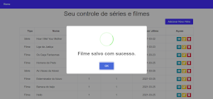

# Projeto Digital Innovation One

## MySql - Como modelar um banco de controle de séries assistidas.

### Instruções

- Instalar componentes do backend e frontmovie (npm i)
- Backend na porta 5000
- Frontend na porta 3000

## bibliotecas

- [sweetalert2](https://sweetalert2.github.io/)

## Prints

Tela inicial:

Mensagem de erro:

Mensagem de Sucesso:

